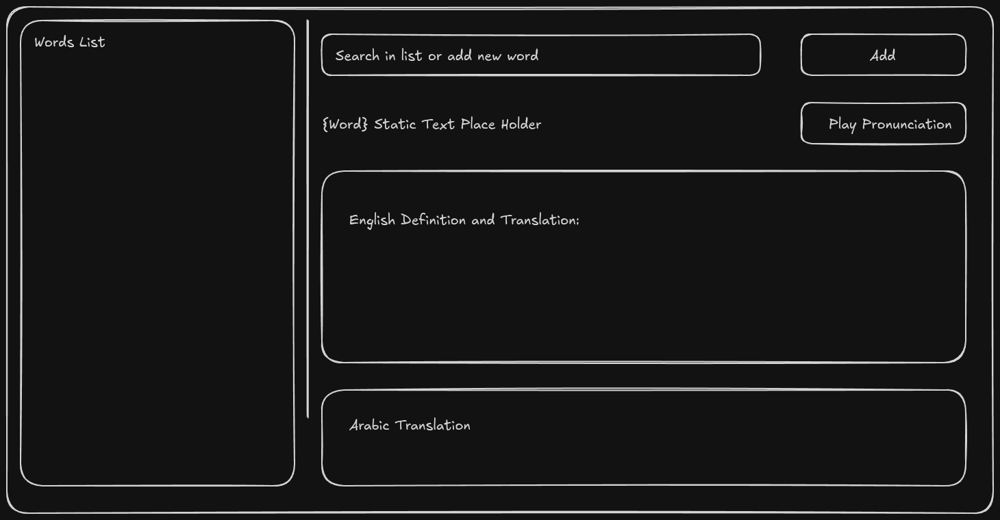

<p align="center">
  
</p>

<h1 align="center">orVocApp</h1>

<p align="center">
A lightweight Qt 6 / QML desktop vocabulary builder for personal word bank management with English definitions, Arabic translations, and audio pronunciations.


</p>

---

## Features

- **Word Bank** -- curate a personal vocabulary list with automatic alphabetical sorting
- **English Definitions** -- instant lookup via [Free Dictionary API](https://dictionaryapi.dev/)
- **Arabic Translations** -- powered by Google Translate (GTX API) with full RTL support
- **Audio Pronunciation** -- play word pronunciations directly in the app
- **Search & Filter** -- real-time case-insensitive filtering as you type
- **Import / Export** -- JSON and plain-text formats for portability
- **Dark Blue Theme** -- off-white text on dark blue, easy on the eyes
- **Splash Screen** -- branded launch screen
- **Cross-Platform** -- targets Ubuntu/Linux and Windows 10/11

## UI Layout

The interface uses a two-column layout: words list on the left, search, translation and pronunciation on the right.


<p align="center">
  
</p>

## Building

### Requirements

- CMake 3.16+
- Qt 6.8+ (tested with 6.10.2)
- C++17 compiler (GCC 7+ / MSVC 2017+)
- Catch2 v3 (for tests)

### Linux

```bash
cmake -B build -DCMAKE_BUILD_TYPE=Release -DCMAKE_PREFIX_PATH=$HOME/Qt/6.10.2/gcc_64
cmake --build build
```

### Windows

```batch
cmake -B build -DCMAKE_BUILD_TYPE=Release -DCMAKE_PREFIX_PATH=C:\Qt\6.10.2\msvc2019_64
cmake --build build --config Release
```

### Run

```bash
./build/orVocab/orVocApp        # Linux
build\orVocab\Release\orVocApp  # Windows
```

## Testing

```bash
cd build && ctest --output-on-failure
```

6 unit tests covering:
- VocabManager: add/remove, filtering, JSON persistence, import/export
- NetworkClient: dictionary API parsing, translation API parsing

## Packaging

### Linux (.deb)

```bash
./build-package.sh
# or from existing build:
./generate-deb.sh
```

Installs to `/usr/lib/orvocapp/` with bundled Qt libs, QML modules, and plugins. Launch with `orvocapp`.

### Windows (NSIS installer)

```batch
set QT_PREFIX_PATH=C:\Qt\6.10.2\msvc2019_64
build-package.bat
```

Requires [NSIS](https://nsis.sourceforge.io/) installed.

## Architecture

```
orVocab/
  main.cpp              # Entry point, singleton registration, splash screen
  vocabmanager.h/cpp    # Word bank CRUD, JSON persistence, import/export
  networkclient.h/cpp   # REST API calls, response parsing
  Main.qml              # Root layout, toolbar, file dialogs
  Sidebar.qml           # Word list, search/add, context menu
  TranslationView.qml   # Definition display, Arabic RTL, audio playback
  SplashScreen.qml      # 3-second branded splash
tests/
  test_vocabmanager.cpp  # VocabManager unit tests (Catch2)
  test_networkclient.cpp # NetworkClient unit tests (Catch2)
packaging/
  orvocapp.desktop       # Linux desktop entry
  orvocapp-wrapper.sh    # Runtime environment wrapper
  postinst / postrm      # Icon cache refresh scripts
```

### Key Design Decisions

| Decision | Choice | Rationale |
|----------|--------|-----------|
| Networking | QNetworkAccessManager | Native Qt, no external deps |
| Parsing | QJsonDocument | Deep nested API response handling |
| Testing | Catch2 v3 (TDD) | Tests written before implementation |
| Persistence | vocab.json via QStandardPaths | Cross-platform app data location |
| Arabic RTL | Inline HTML `dir="rtl"` | Works in QML RichText |
| File Dialogs | Qt.labs.platform | Avoids XDG portal freeze on Linux |
| Encoding | UTF-8 project-wide | Arabic character support |

## APIs Used

| API | Purpose | URL |
|-----|---------|-----|
| Free Dictionary API | English definitions + phonetics + audio | `api.dictionaryapi.dev/api/v2/entries/en/{word}` |
| Google Translate GTX | English to Arabic translation | `translate.googleapis.com/translate_a/single` |

## License

Private project.
