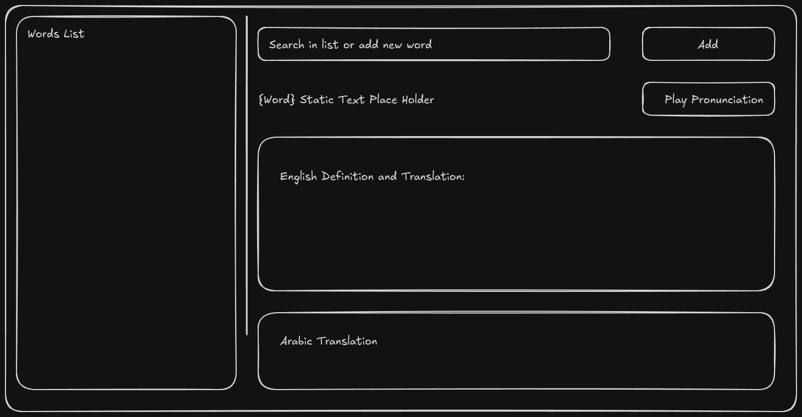
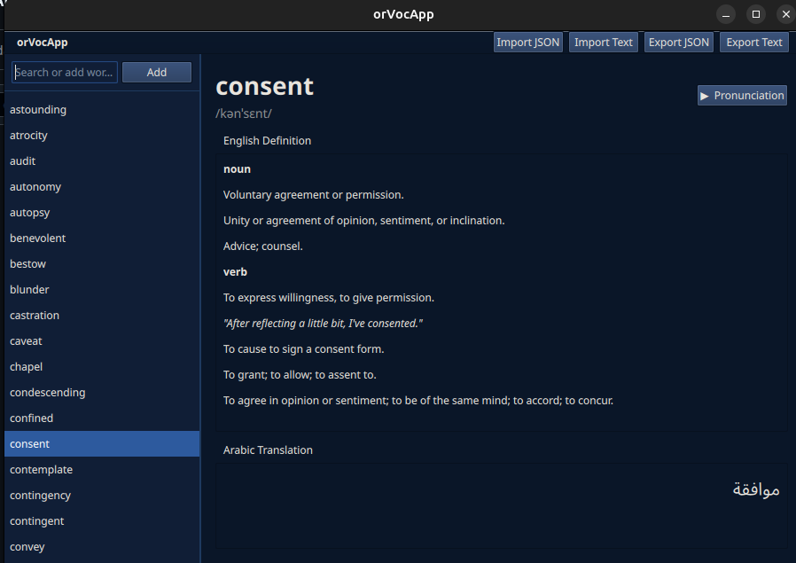

<p align="center">
  
</p>

<h1 align="center">orVocApp</h1>

<p align="center">
A lightweight Qt 6 / QML desktop vocabulary builder for personal word bank management with English definitions, Arabic translations, and audio pronunciations.


</p>

---

## Features

- **Word Bank** -- curate a personal vocabulary list with automatic alphabetical sorting
- **English Definitions** -- Merriam-Webster Collegiate Dictionary (keyed, collegiate/json) + embedded IPA pronunciation
- **Arabic Translations** -- powered by Google Translate (GTX API) with full RTL support
- **Audio Pronunciation** -- MW `soundc11` host, plays `.wav` pronunciation clips
- **Search & Filter** -- real-time case-insensitive filtering as you type
- **PDF Dictionary Export** -- generate a formatted PDF dictionary with cover page, letter tabs, and spacious entry layout (A4 or Letter)
- **Import / Export** -- JSON (word list + cached English definitions) and plain-text (word list only) formats, consolidated toolbar with format selection popups
- **Definition Caching** -- successful MW lookups are cached to disk and reused everywhere (sidebar, PDF/JSON export), keeping usage well under the daily quota
- **Dark Blue Theme** -- off-white text on dark blue, easy on the eyes
- **Splash Screen** -- branded launch screen
- **Cross-Platform** -- targets Ubuntu/Linux and Windows 10/11

## UI Layout

The interface uses a two-column layout: words list on the left, search, translation and pronunciation on the right.

<p align="center">
  
</p>

## Screenshot

<p align="center">
  
</p>

## Building

### Requirements

- CMake 3.16+
- Qt 6.8+ (tested with 6.10.2)
- C++17 compiler (GCC 7+ / MSVC 2017+)
- Catch2 v3 (for tests)

### Linux

```bash
cmake -B build -DCMAKE_BUILD_TYPE=Release -DCMAKE_PREFIX_PATH=$HOME/Qt/6.10.2/gcc_64
cmake --build build
```

### Windows

```batch
cmake -B build -DCMAKE_BUILD_TYPE=Release -DCMAKE_PREFIX_PATH=C:\Qt\6.10.2\msvc2019_64
cmake --build build --config Release
```

### Run

```bash
./build/orVocApp/orVocApp        # Linux
build\orVocApp\Release\orVocApp  # Windows
```

## Testing

```bash
cd build && ctest --output-on-failure
```

17 unit tests covering:
- VocabManager: add/remove, filtering, JSON persistence, import/export
- NetworkClient: dictionary API parsing, translation API parsing
- WordEntry: default state validation
- PdfExporter: letter color uniqueness, PDF file generation (A4 + Letter), multiple letter groups
- BaseExporter: cancellation, retry backoff schedule, inter-word pacing
- JsonExporter: definitions written for fetched words, bare word retained on fetch failure

## Packaging

### Linux (.deb)

```bash
./build-package.sh
# or from existing build:
./generate-deb.sh
```

Installs to `/usr/lib/orvocapp/` with bundled Qt libs, QML modules, and plugins. Launch with `orvocapp`.

### Windows (NSIS installer)

```batch
set QT_PREFIX_PATH=C:\Qt\6.10.2\msvc2019_64
build-package.bat
```

Requires [NSIS](https://nsis.sourceforge.io/) installed.

## Architecture

```
orVocApp/
  main.cpp              # Entry point, singleton registration, splash screen
  vocabmanager.h/cpp    # Word bank CRUD, JSON persistence, import/export
  networkclient.h/cpp   # REST API calls, response parsing
  dictionarycache.h/cpp # Disk-persisted cache of MW definition lookups (quota protection)
  baseexporter.h/cpp    # Abstract base class for exporters (cache-first fetch pipeline)
  pdfexporter.h/cpp     # PDF dictionary export (async, threaded rendering)
  jsonexporter.h/cpp    # JSON export with definitions (async, fetches cache-missing words only)
  Main.qml              # Root layout, toolbar, file dialogs
  Sidebar.qml           # Word list, search/add, context menu
  TranslationView.qml   # Definition display, Arabic RTL, audio playback
  NotificationOverlay.qml # Toolbar progress bar and fading notifications
  ExportPopup.qml       # Export format selection dropdown (JSON/Text/PDF)
  ImportPopup.qml       # Import format selection dropdown (JSON/Text)
tests/
  test_vocabmanager.cpp  # VocabManager unit tests (Catch2)
  test_networkclient.cpp # NetworkClient unit tests (Catch2)
  test_pdfexporter.cpp   # PdfExporter unit tests (Catch2)
  test_jsonexporter.cpp  # JsonExporter unit tests (Catch2)
packaging/
  orvocapp.desktop       # Linux desktop entry
  orvocapp-wrapper.sh    # Runtime environment wrapper
  postinst / postrm      # Icon cache refresh scripts
```

### Key Design Decisions

| Decision | Choice | Rationale |
|----------|--------|-----------|
| Networking | QNetworkAccessManager | Native Qt, no external deps |
| Parsing | QJsonDocument | Deep nested API response handling |
| Testing | Catch2 v3 (TDD) | Tests written before implementation |
| Persistence | vocab.json via QStandardPaths | Cross-platform app data location |
| Arabic RTL | Inline HTML `dir="rtl"` | Works in QML RichText |
| File Dialogs | Qt.labs.platform | Avoids XDG portal freeze on Linux |
| Encoding | UTF-8 project-wide | Arabic character support |

## APIs Used

| API | Purpose | URL |
|-----|---------|-----|
| Merriam-Webster Collegiate | English definitions + IPA + pronunciation audio | `www.dictionaryapi.com/api/v3/references/collegiate/json/{word}?key={KEY}` |
| Google Translate GTX | English to Arabic translation | `translate.googleapis.com/translate_a/single` |

## Quota & Audio

- English lookups call Merriam-Webster's Collegiate API (~**1000 req/day** shared daily quota, requires a free key). Arabic via GTX is separate and effectively unlimited.
- Pronunciation clips come from `media.merriam-webster.com/soundc11/` (`.wav`); audio is played via QtMultimedia (FFmpeg backend).

## Definition Caching

To stay within MW's daily quota, every successful definition lookup (word + phonetic + audio URL) is cached to `dictionary_cache.json` under the app's data directory, keyed by lowercased word. The cache is shared by every lookup path:

- **Sidebar / word lookup** -- cache-first: checks the cache before calling MW; only fetches live on a cache miss.
- **PDF export** -- same cache-first behavior per word; a word not yet cached is fetched and cached before rendering.
- **JSON export** -- `words` + a `definitions` map (English definition HTML only -- no translation or pronunciation) are written instantly from whatever's cached. Exporting via the toolbar's JSON option additionally fetches any definitions still missing from the cache (reusing the same progress UI as PDF export) and tolerates per-word fetch failures -- a word that can't be fetched is still included in `words`, just without a `definitions` entry, so one bad word never fails the whole export.
- **JSON import** -- re-hydrates the cache from an imported file's `definitions` map (overwriting any existing local entries for those words), so a shared/exported word bank doesn't need to re-spend quota on words it already has definitions for.
- **Text export/import** -- unaffected; always a plain word list with no cache interaction.
- **Removing a word** -- also evicts its cached definition, so deleting and re-adding a word forces a fresh MW lookup.

## Failure Logging

Every definition/translation fetch failure (network error, parse error, or a word that exhausted all retries) is recorded to `app.log` under the app's data directory, with a timestamp, the word, which phase (definition/translation), and the error. The log is truncated at the start of every app launch, so it always reflects only the current session -- useful for diagnosing a failed export after the fact (e.g. distinguishing an MW parsing bug from a GTX rate-limit from a plain connectivity drop) without attaching a debugger.

## License


Private project.
